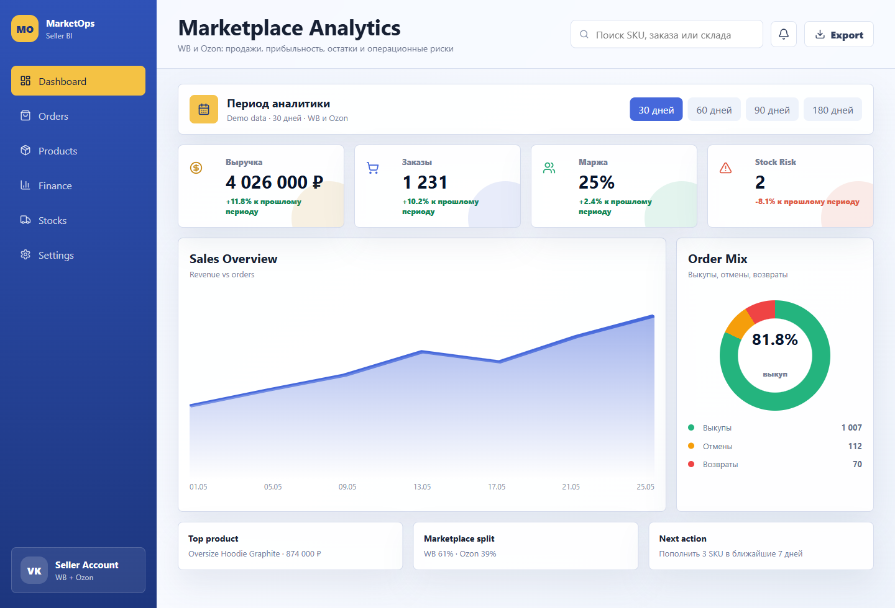
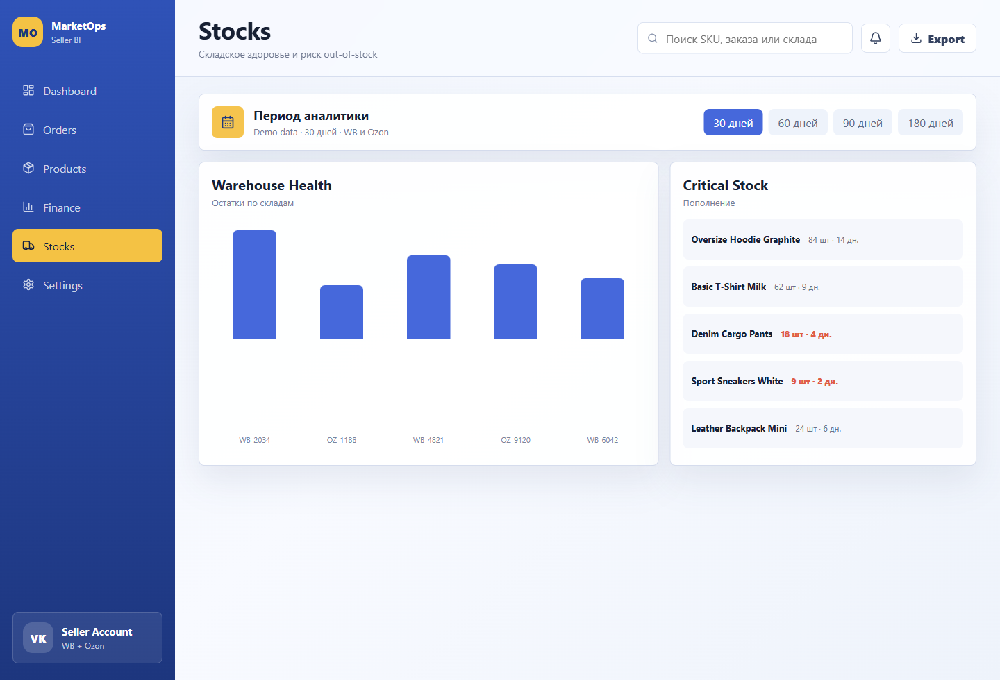
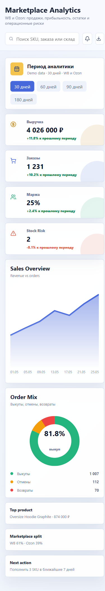

# WB / Ozon Analytics Dashboard

Clean internal analytics dashboard for sellers working with Wildberries and Ozon.
The repository is now a custom implementation with a fresh Git history and no code from
the previously cloned public project.

## Project Purpose

The service is designed for automatic marketplace analytics:

- collect orders, stock and product status data from WB and Ozon APIs;
- normalize marketplace data into one dashboard model;
- show revenue, orders, buyout rate, stock risk and top products;
- provide separate views for orders, products, financial analytics and stock health;
- keep the interface simple enough for daily operational work.

## Screenshots

### Dashboard


### Stocks



### Mobile



## Stack

- Frontend: React, TypeScript, Vite, plain CSS, Lucide icons.
- Backend: FastAPI, Pydantic Settings, HTTPX.
- Planned storage: PostgreSQL.
- Planned scheduling: Celery, Dramatiq, APScheduler or managed cron, depending on hosting.

## Quick Start

### Frontend

```bash
cd frontend
npm install
npm run dev
```

Open:

```text
http://localhost:5173
```

### Backend

```bash
cd backend
python -m venv .venv
.venv\Scripts\activate
pip install -r requirements.txt
uvicorn app.main:app --reload
```

Open:

```text
http://localhost:8000/docs
```

## Environment

Copy the example:

```bash
copy .env.example .env
```

Required for real integrations:

```env
WB_API_TOKEN=
OZON_CLIENT_ID=
OZON_API_KEY=
```

Without credentials the frontend uses demo data, and the backend returns integration
status without attempting marketplace calls.

## Repository Structure

```text
.
├── frontend/              # React dashboard
│   ├── src/App.tsx        # Dashboard views and demo data
│   └── src/styles.css     # Visual system
├── backend/               # FastAPI service
│   └── app/
│       ├── api/           # HTTP routes
│       └── marketplaces/  # WB/Ozon API client skeletons
├── docs/assets/           # Product screenshots
└── .env.example           # Configuration template
```

## Next Milestones

- Add authenticated marketplace account setup.
- Implement real WB order/stock/product sync.
- Implement real Ozon posting/product/finance sync.
- Add PostgreSQL persistence and scheduled sync jobs.
- Add financial model: ads, logistics, commission and margin.
- Add deploy profile for frontend + API backend.

## License

Proprietary by default. Add an explicit license before open-source distribution.

